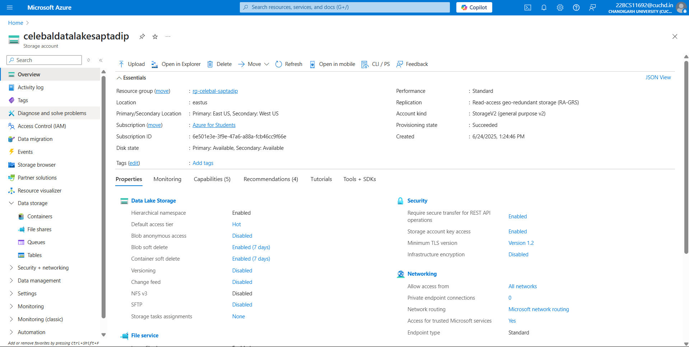
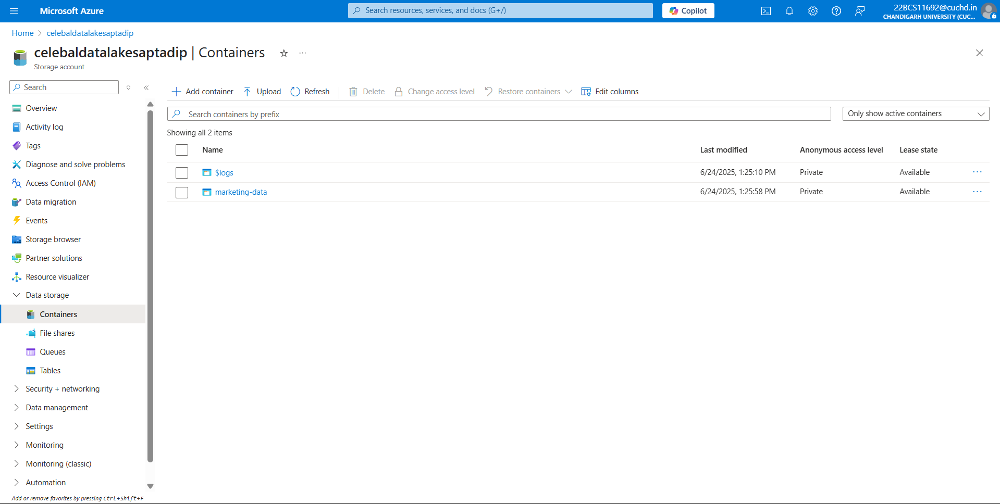
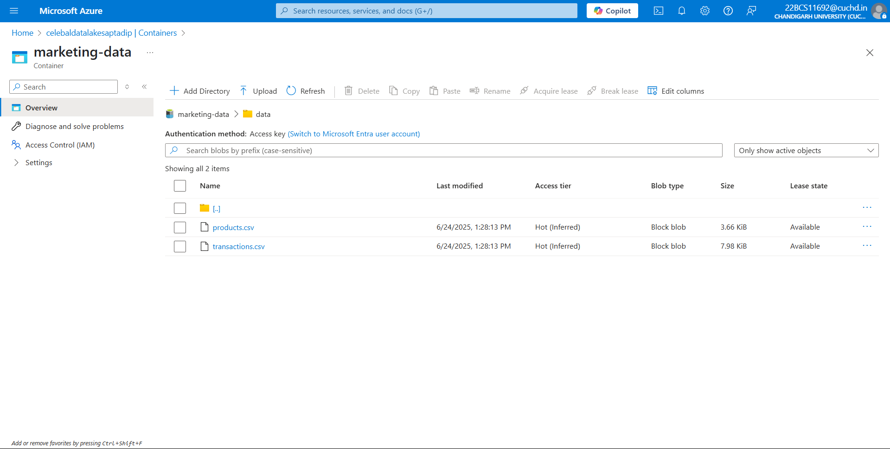
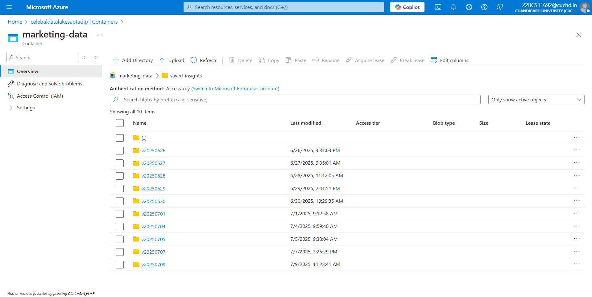
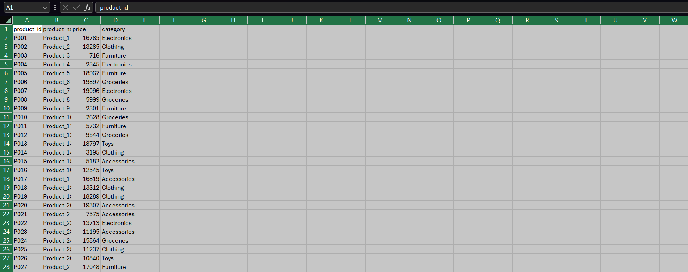
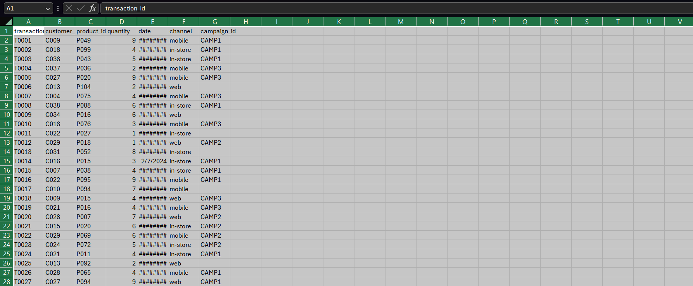

# 🎯 LIVE PROJECT DEMO

✅ **Live Site:** [https://celelytics.onrender.com/](https://celelytics.onrender.com/)  
🛡️ **Admin Portal:** [https://admin-celelytics.onrender.com/](https://admin-celelytics.onrender.com/)

---

# 📊 Celelytics – Marketing Campaign Analytics Dashboard

Welcome to **Celelytics**, a dynamic and feature-rich **Marketing Campaign Analytics** web application built by **Saptadip** during a Data Engineering Internship at **Celebal Technologies**.

This project empowers businesses to analyze marketing campaigns, customer purchases, and product performance through a **cloud-integrated**, **AI-assisted**, and **Spark-enabled** platform. It offers seamless data upload, insightful visual analytics, intelligent support via a chatbot, and backend integration with Azure storage systems.

Deployed using **Render**, it features both a **public user dashboard** and a **secure admin portal**.

---

## 📸 Screenshots

📂 All visual references are located inside  
`celelytics-marketing-analytics-dashboard/Screenshots/`

| Feature | Screenshot |
|--------|------------|
| **Home Page** |  |
| **Upload Data Page** |  |
| **Insights Page** |  |
| **Contact Page** |  |
| **AI Assistant Toggle** | <div align="center"></div> |
| **Admin Login Page** |  |
| **Admin Messages Panel** |  |

---

## ☁️ Cloud Storage Architecture (Azure ADLS Gen2)

> 🗂 Cloud resource: **Storage Account – `celebaldatalakesaptadip`**

**📄 Supporting JSON Configuration File:**  
[📂`celebaldatalakesaptadip_storage_account.json`](Cloud%20JSON%20File/celebaldatalakesaptadip_storage_account.json)

### ✅ Storage Structure:

```
Azure Storage Account: celebaldatalakesaptadip
├── Container: marketing-data
│   ├── Directory: data
│   │   ├── transactions.csv
│   │   └── products.csv
│   └── Directory: saved-insights
│       └── insights_<timestamp>.json
```

### 📷 Visual References

| Description | Screenshot |
|------------|------------|
| **Storage Account Overview** |  |
| **Container List** |  |
| **marketing-data Container** |  |
| **Data Directory** |  |
| **Saved Insights Directory** |  |
| **Sample Products Dataset** |  |
| **Sample Transactions Dataset** |  |

---

## 🛠️ How It Works (Problem Statement Breakdown)

---

### 🔹 1. Load Transaction Data from ADLS Gen2

- Sample data (`transactions.csv` and `products.csv`) is stored in Azure Data Lake Gen2 inside a structured container hierarchy.
- Data is accessed using secure Spark-compatible file paths using `abfss://` protocol.
- Ingestion into **PySpark DataFrames** ensures scalability and speed.

---

### 🔹 2. Extract Insights

Using Spark DataFrames and SQL:

- Transactions are **joined** with product metadata (price, category, description).
- Aggregations and transformations reveal:
  - 🔸 **Average Order Value** per customer
  - 🔸 **Top-performing products and categories**
  - 🔸 **Impact of marketing campaigns** on revenue and engagement

Example Spark code:
```python
avg_order = df.groupBy("customer_id").agg(avg("order_value").alias("avg_order_value"))
```

---

### 🔹 3. Create a Managed Delta Table

> ⚠️ **Databricks was not used**, since it is not available under the **Free Tier** for Azure for Students.

- As a workaround, a **local simulation** of Delta table behavior was created using **Flask + Pandas** to emulate data persistence, schema evolution, and versioning-like functionalities.
- While not a true Delta table, this approach ensures extracted insights are still processed, stored, and version-controlled on cloud.

---

### 🔹 4. Optimize Data Storage

- Extracted insights are saved into **Azure ADLS Gen2** under the folder `saved-insights/` in compact **JSON format**.
- This ensures:
  - Efficient data transfer
  - Light-weight retrieval for future reuse
  - Long-term archival

---

### 🔹 5. Monitor Data Quality

- Implemented in `process.py` using:
  - 🔍 `isNull()` filters to detect **missing values**
  - 📊 IQR (Interquartile Range) logic for **outlier detection**

Errors and null-value summaries are displayed to users directly on the dashboard.

---

## ✨ Additional Features

- 🤖 **Insights Bot (GPT-3.5)**  
  A conversational assistant built into the dashboard using **OpenAI’s GPT-3.5**, designed to help users interpret trends, ask business questions, and explore hypothetical scenarios.

- 💬 **Contact Me Form**  
  A secure and responsive form to allow users to **send messages**, raise queries, or give feedback. These messages are stored and shown in the admin portal.

- 💾 **Insight Storage in JSON Format**  
  Every analysis result is **auto-saved** into **`saved-insights/`** directory in the cloud — ready for retrieval or audit.

- 🖥️ **Interactive Web Dashboard**  
  The interface is modern, mobile-responsive, and intuitive — featuring uploads, visualizations, charts, and toggles for enhanced user experience.

- 🔐 **Admin Portal**  
  Includes login-based access and a panel to **view user messages**, audit insights, and moderate interaction.

---

## ✅ Core Functionalities Recap

- 📦 Unified analysis across **web, mobile, and in-store** channels
- 🧱 Modularized data flow – ingest → clean → join → analyze → store
- 🔍 Strong validation, schema enforcement, and failure reporting
- 📊 Clear chart visuals using **Chart.js**
- 🔁 Reusable helper functions (data validation, transformations)

---

## ⚙️ Tech Stack

| Layer        | Technologies Used |
|--------------|-------------------|
| 🌐 Frontend   | HTML, CSS, JavaScript, Chart.js |
| 🔙 Backend    | Python, Flask, Pandas |
| ⚡ Processing | PySpark (Simulated locally) |
| ☁️ Storage    | Azure Data Lake Storage Gen2 |
| 📤 Export     | JSON (cloud) + CSV (optional) |
| 🤖 AI Support | OpenAI GPT-3.5 via API |
| 🚀 Deployment | Render (Main App + Admin Panel) |

---

## 🚧 Challenges Faced & Solutions

| Challenge | Resolution |
|----------|------------|
| ❌ Azure Databricks unavailable under free tier | ✔️ Built a local Delta simulation using Flask and Pandas |
| ❌ Navbar + footer overlapping content on mobile | ✔️ Custom media queries and layout fixes |
| ❌ Railway deployment failed | ✔️ Switched deployment to Render with success |
| ❌ Outlier logic errors | ✔️ Refined with percentile-based detection |
| ❌ Dataset schema mismatches | ✔️ Added frontend + backend validation logic |

---

## 🗂️ Project Structure

```
celelytics-marketing-analytics-dashboard/
├── app.py
├── process.py
├── requirements.txt
├── .env.template
├── procfile
├── runtime.txt
├── templates/
│   └── index.html
├── static/
│   └── assets/
├── Screenshots/
│   ├── homepage.png
│   ├── upload-page.png
│   ├── insights-page.png
│   ├── contact-page.png
│   ├── chat-assistant.png
│   ├── admin-login.png
│   ├── admin-messages.png
│   ├── celebaldatalakesaptadip_overview.png
│   ├── celebaldatalakesaptadip_containers.png
│   ├── container_marketing-data.png
│   ├── data_directory.png
│   ├── saved-insights.png
│   ├── sample_products_dataset.png
│   └── sample_transactions_dataset.png
├── Cloud JSON File/
│   └── celebaldatalakesaptadip_storage_account.json
└── celelytics-admin-portal/
```

---

## 📢 Legal Notice

> © 2025 **Celelytics Dashboard** by **Saptadip**  
> **All Rights Reserved.**  
> This project is the intellectual property of the author.  
> **Copying, distributing, or reproducing any part of this work is strictly prohibited without explicit written permission.**

---

## 🙌 Acknowledgements

Special thanks to **Himanshi Ma’am, Sharthak Acharjee, Prerna Kamat, Priyanshi Jain**, and **Akash Aggarwal** at **Celebal Technologies** for their incredible support and mentoring throughout the internship.

---

> For queries or collaboration, feel free to reach out via the [Contact Me](https://celelytics.onrender.com/#contact) section on the website.
