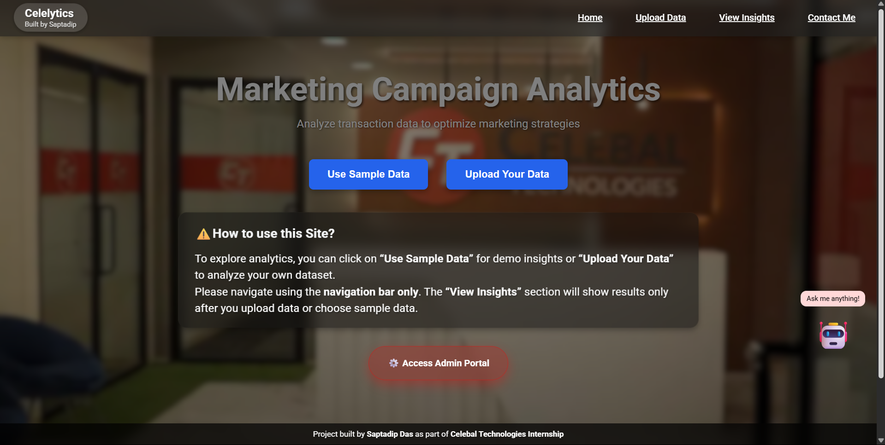
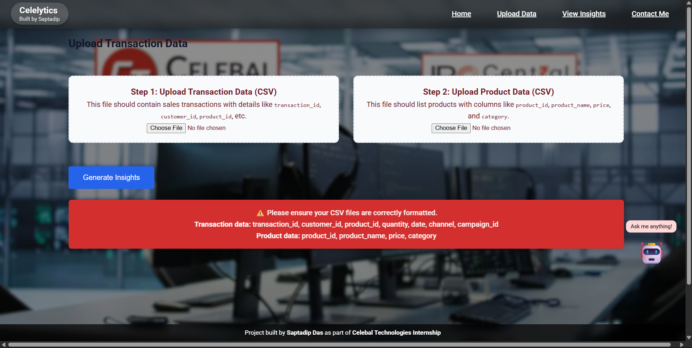
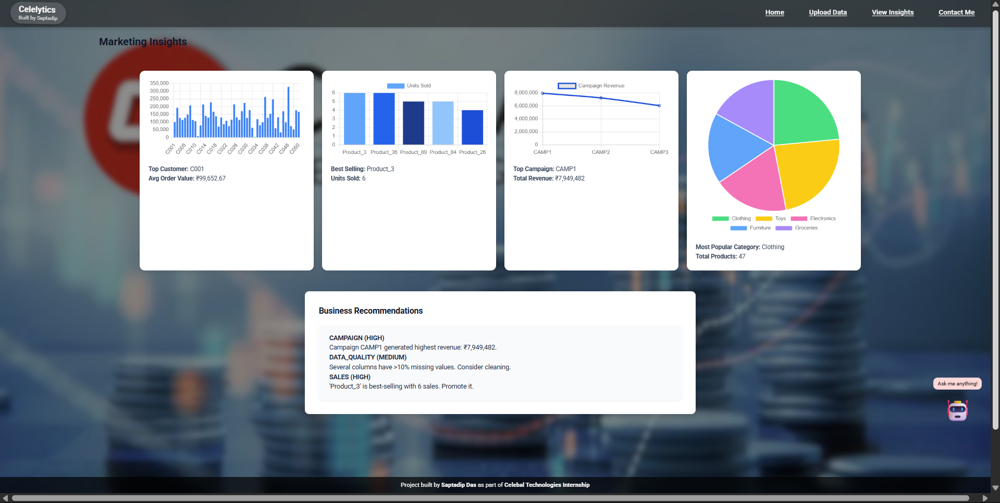
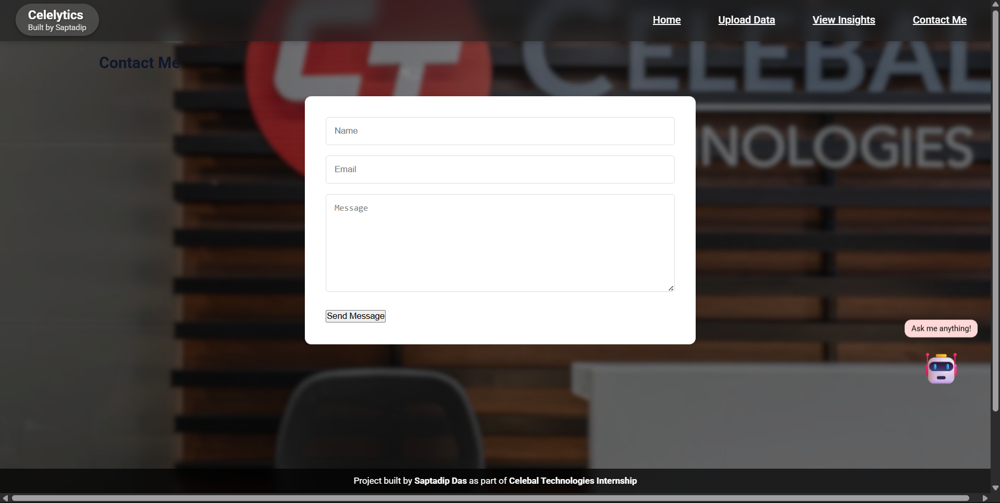
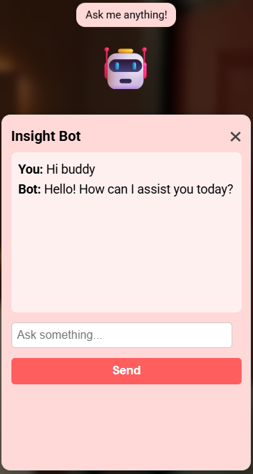
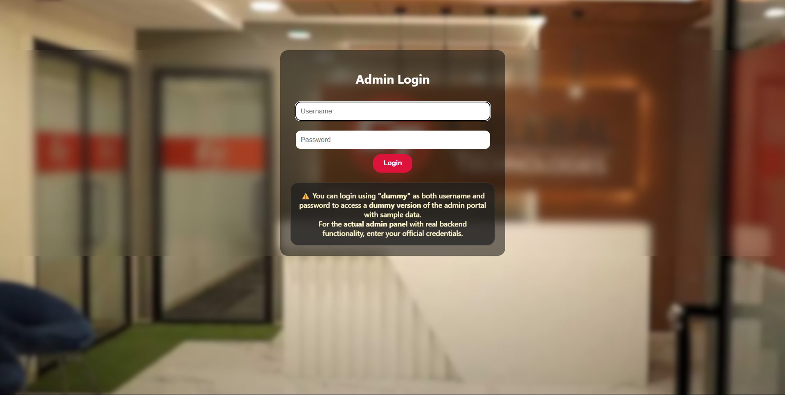
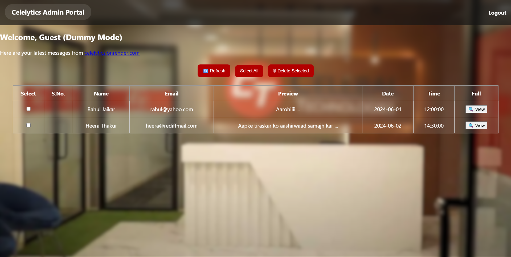

# 🎯 LIVE PROJECT DEMO

✅ **Live Site:** [https://celelytics.onrender.com/](https://celelytics.onrender.com/)  
🛡️ **Admin Portal:** [https://admin-celelytics.onrender.com/](https://admin-celelytics.onrender.com/)

---

# 📊 Celelytics Marketing Analytics Dashboard

Welcome to **Celelytics**, a full-stack **Marketing Analytics Dashboard** developed as part of a Data Engineering Internship at **Celebal Technologies**.

This modern web app enables businesses to:
- Upload marketing and transactional data
- Extract actionable insights using Spark
- Monitor data quality
- Interact with visualized analytics
- Use an AI assistant for help
- Manage contact messages via a secure admin panel

> ⚡ Deployed using **Render** for both the main dashboard and the admin panel.

---

## 📸 Screenshots

> All screenshots are available in the folder:  
> `celelytics-marketing-analytics-dashboard/Screenshots/`

| Page | Screenshot |
|------|------------|
| **Home Page** |  |
| **Upload Data Page** |  |
| **Insights Page** |  |
| **Contact Page** |  |
| **AI Assistant Toggle** | <div align="center"></div> |
| **Admin Login Page** |  |
| **Admin Messages Panel** |  |

---

## 🛠️ How It Works (Problem Statement Breakdown)

---

### 🔹 1. Load Transaction Data from ADLS Gen2

- CSV files stored in **Azure Data Lake Gen2** are read using Azure SDK and loaded into **Spark DataFrames**.
- Credentials are securely handled using environment variables.
- Used `abfss://` connector with Spark to ingest large volumes of raw transaction data.

---

### 🔹 2. Extract Insights

- Product metadata (price, category, description) from another CSV is joined with transaction data.
- Spark joins are used to correlate transaction IDs with product details.
- Business insights extracted:
  - **Average Order Value (AOV)** per customer
  - **Most popular products & categories**
  - **Impact of marketing campaigns** on sales using grouped analysis
- Spark SQL and DataFrame APIs used to run aggregations.

```python
avg_order = df.groupBy("customer_id").agg(avg("order_value").alias("avg_order_value"))
```

---

### 🔹 3. Create a Managed Delta Table

⚠️ **Note:** Due to Azure's Free Student Subscription limitations, **Databricks was not used** for creating the Delta Table.

- Instead, a simulated local version of Delta-style persistence was created using **Flask and Pandas** to mimic the behavior of storing transformed insights.
- This setup ensures that the insights can still be saved, displayed, and exported for future use, maintaining the learning goal of this task.

---

### 🔹 4. Optimize Data Storage

- Data is optimized through:
  - **JSON compression**
  - **Selective loading** and writing from cloud
- Insights are stored in a **compact JSON format in Azure Storage** for efficient use and retrieval.

---

### 🔹 5. Monitor Data Quality

- Implemented missing value checks:
  - `isNull()` filters to flag incomplete rows
- Outlier detection done via:
  - IQR (Interquartile Range)
  - Threshold-based filters
- Quality summaries displayed alongside insights.

---

## ✨ Additional Features

- 🤖 **Insights Bot (GPT-3.5)**  
  A built-in **AI chatbot** named **Insights Bot**, powered by OpenAI's GPT-3.5 model, helps users get deeper business insights and suggestions based on uploaded data.

- 📩 **Contact Me Form**  
  A simple yet powerful contact form where users can **submit messages**, report bugs, or share ideas.

- 💾 **JSON-based Insight Storage**  
  All extracted insights are automatically saved in **JSON format** in **Azure Cloud Storage** for future reference and export.

- 🌐 **Interactive Web App**  
  The project includes a **user-friendly frontend** to simplify interactions, uploads, and analytics, enhancing user experience.

- 🔐 **Admin Panel**  
  A secured admin portal with login authentication allows viewing and managing all submitted contact messages.

---

## ✅ Additional Functionalities

- **Supports Multiple Channels**  
  Data from **web, mobile, and in-store** platforms is standardized and merged.

- **Modular & Reusable Code**  
  Common tasks like ingestion, validation, and transformations are abstracted into reusable methods.

- **Validation & Error Handling**  
  - Schema mismatches trigger frontend error alerts  
  - Logging and error catching added to backend logic

---

## ⚙️ Tech Stack

| Layer        | Technology                      |
|--------------|----------------------------------|
| 🌐 Frontend   | HTML5, CSS3, JavaScript, Chart.js |
| 🔙 Backend    | Python, Flask, Pandas            |
| ⚡ Processing | PySpark (local simulation)        |
| ☁️ Storage    | Azure Data Lake Storage Gen2     |
| 💾 Output     | JSON (Cloud), CSV (optional)      |
| 🤖 AI Support | GPT-3.5 via OpenAI API           |
| 🚀 Deployments| Render (Main + Admin)            |

---

## 🚧 Challenges Faced & Solutions

| Challenge | Solution |
|----------|----------|
| ❌ **Databricks Compute Not Available** | ✔️ Simulated using Flask + Pandas + Spark locally |
| ❌ **Mobile scroll and overlap issues** | ✔️ Custom media queries and dynamic margins |
| ❌ **Deployment failure on Railway** | ✔️ Switched to Render – fully stable |
| ❌ **Outlier Identification** | ✔️ Used IQR method + frontend display summaries |
| ❌ **Schema mismatch during joins** | ✔️ Added validation checks pre-merge |

---

## 🗂️ Project Structure

```
celelytics-marketing-analytics-dashboard/
├──celelytics-admin-portal
│
├── static/
│   └── assets/
│
├── templates/
│   └── index.html
│
├── Screenshots/
│   ├── homepage.png
│   ├── upload-page.png
│   ├── insights-page.png
│   ├── contact-page.png
│   ├── chat-assistant.png
│   ├── admin-login.png
│   └── admin-messages.png
│
├── app.py
├── process.py
├── .env.template
├── runtime.txt
├── procfile
├── LICENCE
├── .gitignore
├── requirements.txt
└── README.md
```

---

## 📢 Legal Notice

> © 2025 Celelytics Dashboard by Saptadip  
> **All rights reserved.**  
> This project is proprietary and cannot be copied, distributed, or reproduced in any form without **explicit written permission** from the author.

---

> 🙌 **Special Thanks** to all mentors at Celebal Technologies for their guidance throughout this internship project.
